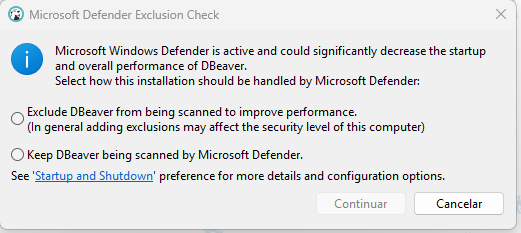
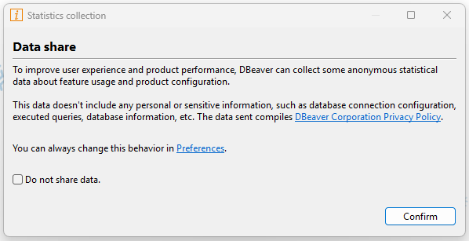

# Configuração inicial do DBeaver: performance e privacidade

Ao executar o DBeaver pela primeira vez no Windows, duas configurações são essenciais para garantir que a ferramenta rode leve e respeite sua privacidade.

### 1. Desempenho (Microsoft Defender)

O DBeaver é baseado na plataforma Eclipse (Java), o que significa que ele manipula milhares de pequenos arquivos durante a execução. A verificação em tempo real do Windows Defender pode causar uma lentidão notável na inicialização e na execução de queries.

**Ação Recomendada:**
1. Selecione a opção: **"Exclude DBeaver from being scanned to improve performance"**.
2. Clique em **Continuar**.

> **Por que fazer isso?** Essa opção cria uma "lista branca" segura no antivírus apenas para os processos do DBeaver. Isso elimina o gargalo de processamento causado pela verificação de cada arquivo `.jar` ou `.xml` que a IDE carrega, tornando o uso muito mais fluido sem comprometer a segurança do sistema.

---

### 2. Privacidade (Coleta de Dados)

Por padrão, o DBeaver solicita o envio de estatísticas de uso anônimas (telemetria) para os desenvolvedores.

**Ação Recomendada:**
1. Marque a caixa de seleção: **[x] Do not share data**.
2. Clique em **Confirm**.

> **Por que fazer isso?** Embora a telemetria ajude os desenvolvedores, em um ambiente de desenvolvimento focado e controlado, é uma boa prática de segurança e privacidade desabilitar envios de dados desnecessários para servidores externos.