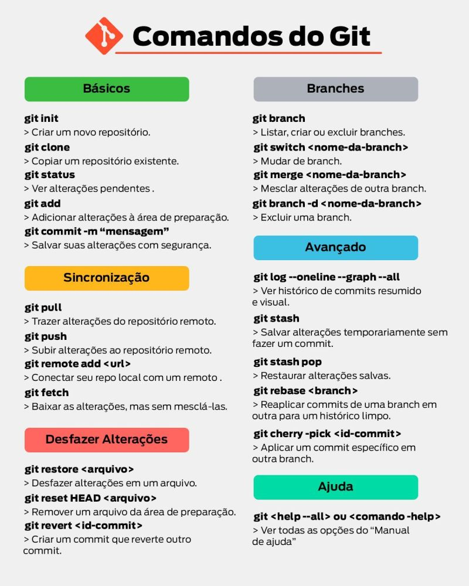

# Comandos essenciais do Git

Referência rápida dos comandos do dia a dia. Para instalar e configurar o Git do zero
(identidade, chave SSH, conexão com o GitHub), veja
[Configuração do Git em ambiente Linux](configuracao-linux-ssh.md).

---

## Básicos

### Criar um novo repositório

```bash
git init
```

### Copiar um repositório existente

```bash
git clone <url>
```

### Ver alterações pendentes

```bash
git status
```

### Adicionar alterações à área de preparação

```bash
git add <arquivo>
```

Para adicionar tudo que mudou:

```bash
git add .
```

### Salvar as alterações preparadas

```bash
git commit -m "mensagem"
```

> A mensagem descreve **o que mudou**, no imperativo: `"Adiciona validação de CPF"`,
> não `"mudanças"`.

---

## Sincronização

### Trazer alterações do repositório remoto

```bash
git pull
```

### Subir alterações ao repositório remoto

```bash
git push
```

### Conectar seu repositório local com um remoto

```bash
git remote add <nome> <url>
```

Por convenção, o remoto principal se chama `origin`:

```bash
git remote add origin git@github.com:usuario/repositorio.git
```

### Baixar alterações, mas sem mesclá-las

```bash
git fetch
```

> `git fetch` atualiza sua cópia do remoto sem tocar nos seus arquivos.
> `git pull` é o `fetch` seguido de um `merge` automático.

---

## Branches

### Listar, criar ou excluir branches

```bash
git branch
```

```bash
git branch <nome-da-branch>
```

### Mudar de branch

```bash
git switch <nome-da-branch>
```

Para criar e já mudar para ela:

```bash
git switch -c <nome-da-branch>
```

### Mesclar alterações de outra branch

```bash
git merge <nome-da-branch>
```

### Excluir uma branch

```bash
git branch -d <nome-da-branch>
```

> ⚠️ `-d` só apaga a branch se ela já tiver sido mesclada. O `-D` (maiúsculo) apaga de
> qualquer jeito — e os commits exclusivos daquela branch ficam órfãos.

---

## Desfazer alterações

### Desfazer alterações em um arquivo

```bash
git restore <arquivo>
```

> ⚠️ Isso descarta as edições não commitadas do arquivo, sem possibilidade de recuperação.

### Remover um arquivo da área de preparação

```bash
git restore --staged <arquivo>
```

A forma antiga, ainda muito usada:

```bash
git reset HEAD <arquivo>
```

### Criar um commit que reverte outro commit

```bash
git revert <id-commit>
```

> É a forma segura de desfazer algo que já foi para o remoto: em vez de reescrever o
> histórico, adiciona um commit novo que anula o anterior.

---

## Avançado

### Ver histórico de commits resumido e visual

```bash
git log --oneline --graph --all
```

### Salvar alterações temporariamente sem fazer um commit

```bash
git stash
```

### Restaurar alterações salvas

```bash
git stash pop
```

> Útil quando você precisa trocar de branch no meio de uma edição: guarda o trabalho em
> andamento, troca, e depois recupera com `git stash pop`.

### Reaplicar commits de uma branch em outra, para um histórico limpo

```bash
git rebase <branch>
```

> ⚠️ Rebase reescreve o histórico. Nunca faça rebase de commits que já foram enviados ao
> repositório remoto e que outras pessoas possam ter baixado.

### Aplicar um commit específico em outra branch

```bash
git cherry-pick <id-commit>
```

---

## Ajuda

### Ver todas as opções do manual de ajuda

```bash
git help --all
```

Ou a ajuda de um comando específico:

```bash
git <comando> --help
```

---

## Resumo visual


