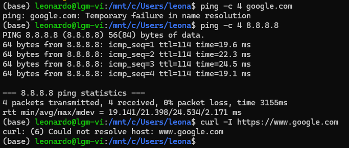

# Solução: Erro de DNS no WSL (Sem Conexão)

**Data:** 03/01/2026
**Erro:** `Temporary failure in name resolution`
**Sintoma:** O ping funciona para IPs numéricos, mas falha para nomes de domínio.

## Evidência


## Diagnóstico
O WSL consegue se conectar à internet (provado pelo ping no `8.8.8.8`), mas não consegue traduzir URLs. Isso ocorre porque o WSL recria o arquivo `/etc/resolv.conf` a cada inicialização, muitas vezes herdando configurações incompatíveis do adaptador de rede do Windows.

---

## Solução Definitiva

Para resolver permanentemente, é necessário impedir que o WSL gerencie o arquivo de DNS e definir um servidor manual.

### 1. Bloquear a geração automática de DNS
Edite o arquivo de configuração global do WSL:

```bash
sudo nano /etc/wsl.conf
```

Adicione o seguinte bloco ao final do arquivo:

```ini
[network]
generateResolvConf = false
```

Salve o arquivo (`Ctrl+O`, `Enter`) e saia (`Ctrl+X`).

### 2. Definir o DNS do Google
Remova o arquivo `resolv.conf` atual (que é um link simbólico) e crie um novo estático:

```bash
sudo rm /etc/resolv.conf
echo "nameserver 8.8.8.8" | sudo tee /etc/resolv.conf
```

### 3. Reiniciar o serviço
Para que a alteração no `wsl.conf` tenha efeito, encerre a instância do WSL. Execute no **PowerShell** do Windows:

```powershell
wsl --shutdown
```