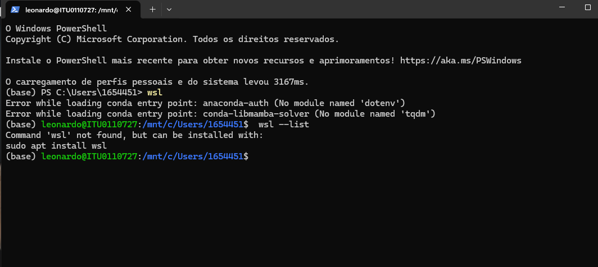

# Registro de Solução: Diagnóstico de Erros de Entrada do Conda no WSL

**Data:** 16 de Outubro de 2023
**Contexto:** Configuração inicial do ambiente de desenvolvimento híbrido (Windows + WSL2).

## O Cenário Inicial

Durante o primeiro acesso ao terminal Linux (Ubuntu via WSL) a partir do PowerShell, o ambiente Conda pré-instalado apresentou erros na inicialização, conforme capturado na imagem abaixo:



## Análise do Problema

A imagem acima evidenciou dois pontos importantes de entendimento do ambiente:

### 1. Mudança de Contexto (Windows vs. Linux)
Observando os prompts de comando, nota-se a transição exata entre os sistemas operacionais:
* **(base) PS C:\Users...** : O usuário estava no PowerShell do Windows.
* **Comando `wsl`**: Ao executar este comando, o terminal "mergulhou" para dentro do subsistema Linux.
* **leonardo@ITU...** : O prompt mudou, indicando que o usuário passou a estar dentro do Ubuntu.
* *Nota:* A tentativa de rodar `wsl --list` logo em seguida falhou porque este é um comando do Windows, e o usuário já estava dentro do Linux naquele momento.

### 2. Os Erros Críticos (Texto Vermelho)
Ao entrar no Linux, o Miniconda tentou carregar plugins automaticamente e falhou:

> Error while loading conda entry point: anaconda-auth (No module named 'dotenv')
> Error while loading conda entry point: conda-libmamba-solver (No module named 'tqdm')

**Diagnóstico:** O plugin `anaconda-auth` (geralmente usado para logins corporativos na plataforma Anaconda) estava instalado no ambiente base, mas suas dependências (`python-dotenv` e `tqdm`) estavam ausentes ou corrompidas, gerando ruído no terminal a cada login.

## A Solução Aplicada

Tentativas padrão de usar `conda install` falharam em corrigir os pontos de entrada. A solução definitiva foi remover o plugin problemático e forçar a instalação das dependências usando o `pip` diretamente dentro do ambiente WSL.

**Passos executados no terminal Linux:**

1.  **Remoção do plugin problemático:**
    ```bash
    pip uninstall anaconda-auth -y
    ```

2.  **Instalação forçada das dependências via pip:**
    ```bash
    pip install tqdm python-dotenv packaging
    ```

### Resultado
Após aplicar os comandos, sair do WSL (`exit`) e entrar novamente (`wsl`), o terminal carregou de forma limpa, sem apresentar as mensagens de erro em vermelho, confirmando a estabilização do ambiente base.