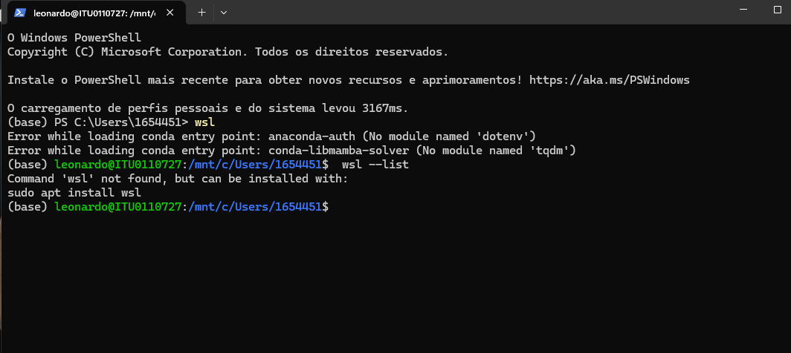

# Erro: `Error while loading conda entry point` no WSL

**Sintoma:** ao abrir o terminal do Ubuntu no WSL, o Conda imprime linhas de erro em
vermelho antes mesmo de você digitar qualquer comando:

```text
Error while loading conda entry point: anaconda-auth (No module named 'dotenv')
Error while loading conda entry point: conda-libmamba-solver (No module named 'tqdm')
```

**Contexto:** Miniconda instalado no WSL2 (Ubuntu). Acontece a cada login, não impede o
uso do Conda, mas polui o terminal.



## Diagnóstico

O Conda carrega seus plugins automaticamente ao iniciar o shell. O plugin `anaconda-auth`
— usado para login na plataforma Anaconda — estava instalado no ambiente `base`, mas as
dependências dele (`python-dotenv` e `tqdm`) estavam ausentes ou quebradas. A cada
inicialização o Conda tenta carregar o plugin, falha, e imprime o erro.

O ambiente continua funcional: é ruído, não uma falha de execução. Mas vale corrigir,
porque mensagens de erro que você aprende a ignorar escondem as que importam.

## Solução

Rodar `conda install` para reinstalar as dependências **não resolve** — o Conda precisa
dos módulos disponíveis antes de conseguir processar o próprio comando. A saída é usar o
`pip` diretamente, no terminal do Linux:

1. Remova o plugin que está falhando:

   ```bash
   pip uninstall anaconda-auth -y
   ```

2. Instale as dependências que faltam:

   ```bash
   pip install tqdm python-dotenv packaging
   ```

3. Saia e entre novamente no WSL, para recarregar o shell:

   ```bash
   exit
   ```

   ```powershell
   wsl
   ```

O terminal deve abrir limpo, sem as linhas em vermelho.

> Se você usa o `anaconda-auth` para autenticar numa conta Anaconda corporativa, reinstale
> o plugin depois de corrigir as dependências: `pip install anaconda-auth`.

---

## Entendendo o contexto: PowerShell ou Linux?

Se você está começando com WSL, vale reparar em um detalhe da captura acima, porque ele
gera confusão constante — o mesmo terminal alterna entre **dois sistemas operacionais**:

| O que aparece no prompt | Onde você está | O que funciona ali |
| --- | --- | --- |
| `PS C:\Users\...>` | PowerShell, no Windows | `wsl`, `wsl --list`, `winget`, `dir` |
| `usuario@maquina:~$` | Ubuntu, dentro do WSL | `apt`, `pip`, `conda`, `ls` |

Digitar `wsl` no PowerShell "mergulha" para dentro do Linux; `exit` volta para o Windows.

Erro clássico decorrente disso: rodar `wsl --list` **depois** de já ter entrado no Linux.
O comando falha porque `wsl` é um executável do Windows — de dentro do Ubuntu ele não
existe. Saia com `exit` antes de usar comandos do Windows.
